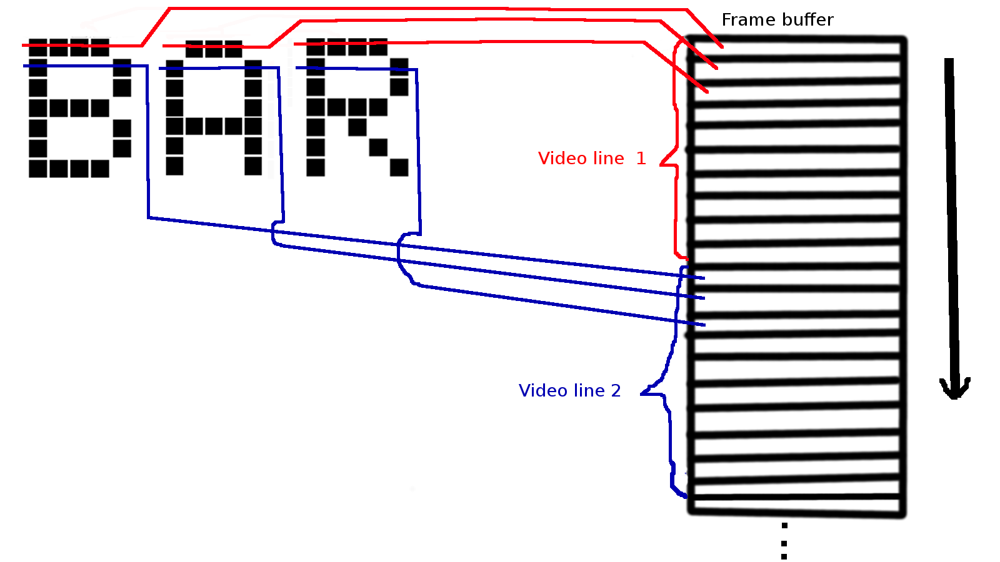
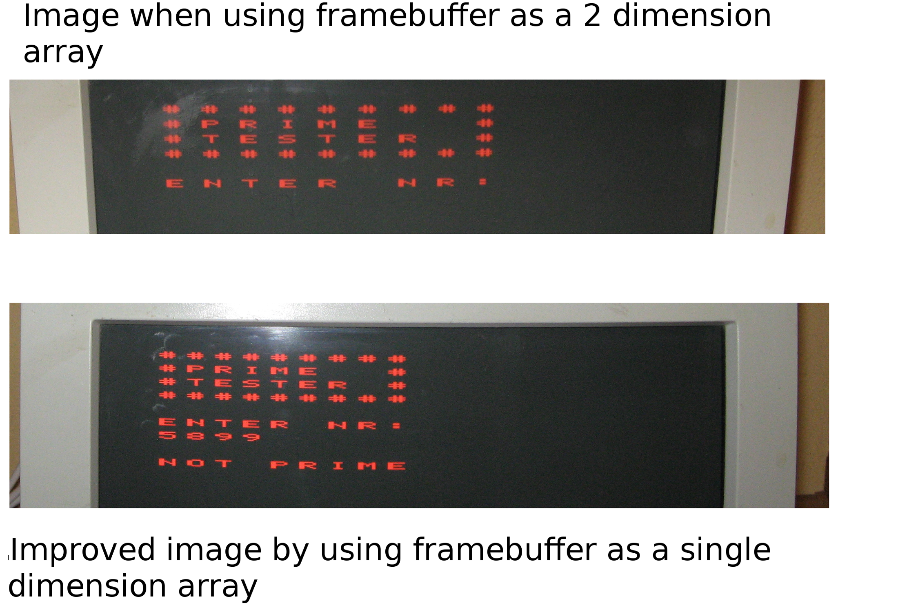
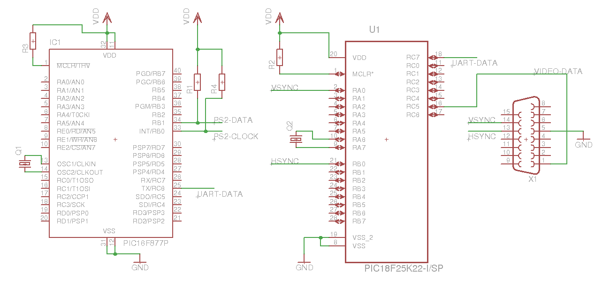

This project is a retro computer made with two PIC microcontrollers:

- a PIC16F877A MCU that acts as the application processor: read PS/2 keyboard input, processes input, sends information to video interface

- a PIC18F25K50 MCU that acts as a video interface: takes input from application processor, stores and modifies the framebuffer, generates VGA signals to be displayed on the monitor

Video mode: 640x480 VGA resolution, monochrome, 14x14 video text mode

The code in the `video-processor` folder of this repo is the code for the PIC18 video processor.

In the folder `application-processor` you can find the code for the PIC16 application processor.

# Video generator

A minimal VGA signal needs the following signals:

- a horizontal sync (HSYNC), used to notify the monitor that it should jump to paint a new line

- a vertical sync (VSYNC), usded to notify the monitor that a full screen was painted and it needs to position back at the top of the screen

- color data (at least one of the red, green or blue), which represent the actual pixels painted on the screen

The HSYNC and VSYNC signals need to have precise timing in order to get a stable video signal

Timings of the sync and data signals are explained in detail by many other people in similar projects.

The websites that I used mostly for this project to be done are the following:

http://dpeckett.com/vga-on-the-arduino-with-no-external-parts --> the site that inspired me the most

http://tinyvga.com/vga-timing/640x480@60Hz --> detailed timing description for my VGA signal

http://www.pyroelectro.com/tutorials/arduino_basic_vga/

My code was written in C language with some assembly and compiled with the Microhip XC-8 compiler.

At first, I decided to generate the HSYNC and VSYNC signals by bit-banging.

The HSYNC signal needs to have a period 31.7us, 3.8us being low to indicate the monitor to jump to the next line and 28.9us needs to be high.

Of the 28.9us high time, during 25.4us we will draw the pixels(active region) and the rest of the time is used as front porch and back porch.

Trying to bit bang this signal and draw pixels during the 25.4us was not very time precise and the output video wiggled and wobbled.

The architecture of the mcu(8 bit, only one work register) and the fact that the code was written in C didn't allow me to have very precise timing.

Consider the following simplified VGA generator code snippet:

```
int line_nr = 0;
while(line_nr < 480)
{
   hsync_pin_high();
   delay_back_porch();
   draw_some_pixels();
   delay_front_porch();
   hsync_pin_low();
   delay_hsync();
   line_nr++;
}
```

What will happen when the variable `line_nr exceeds` the maximum 8-bit value 255 while it counts to 480?

If you look through the assembly code, you will notice that the boundary check will take additional CPU cycles than before.

This way the timing consistency of the signals is lost and video output gets bad.

The PIC18F25K50 mcu runs at a frequencly of 16MHz so every CPU cycle takes 62.5ns.

To fix this problem I made the HSYNC signal to be hardware generated as a PWM signal.

I set the MCU to trigger an interrupt when the PWM signal gets low.

In the interrupt function I will start to draw the current line from the framebuffer.

Because of the timing it takes to read from the framebuffer in the interrupt function, the actual drawing of the pixels will start after the HSYNC singal goes high again.

This way, the drawing of the pixels happens during the active region.

After drawing the pixels, a small part of the time remaining until the next interrupt is used to increment the line number and the rest is idle time.

Vertical sync time takes 2 lines starting from line number 480.

During vertical sync I disable interrupts and draw additional characters into the framebuffer if necessary.

To draw the pixels I used the trick learned from Daniel Peckett's project(first link above).

The trick is to push the pixels from the SPI data line since this is very fast and doesn't need any CPU cycle.

Every byte loaded in the SPI TX register means 8 pixels drawn on the screen.

The pixel clock for 640x480 VGA mode is 25.17 MHz.

I used 8MHz as the SPI frequency and this way one pixel drawn by us is actually ~3 times wider than the pixel in the standard 640x480 mode.

Another detail is to choose a SPI mode where SPI data line is low while idle, because the VGA monitor expects the data signals to be low when it's not in the active region.

For the characters drawn on the screen I chose the fonts to be the ones from the well known HD44780 LCD controller.

The font dimensions are 5 pixels wide and 7 pixels tall.

I manually transposed these fonts from their drawing in the datasheet to a 2 dimension C array.

The 5 pixels from every character line are loaded in the 8 bits SPI register.

The remaining 3 pixels from the register being zero, will appear as black on the screen.

These 3 black pixels will be interpreted as space between the characters, and this way we don't need to add additional spaces between characters in our framebuffer.

First, I used the framebuffer as a two dimension C array. The two dimension array was the logical way to go, as it resembled the lines and columns model of a display. Because of the time penalty of reading from a double array, the black space between consecutive characters was pretty big.

I then changed the framebuffer to be a single dimension C array. This meant reading faster from memory at the expense of an increased code complexity. The spaces between characters became smaller and the displayed looked better.





A line of text means 7 lines drawn on the screen because height of the fonts is 7 lines.

Framebuffer size is 14 text lines * 7 lines height of each text line * 14 chars per text line = 1372 bytes. The total amount of RAM in the chip is 1522 bytes. Framebuffer is ~90% of the whole RAM.

For readability, between two consecutive text lines I wait 7 empty black lines. These lines are not added to the framebuffer since they are empty and we don't want to waste memory.

The fonts that are drawn on the screen are received on the UART RX line of the MCU.

During the vertical sync time frame, which has a duration of 2 lines(63 us), I check if any character was received over UART and if it is the case, I draw it to the framebuffer.

The characters supported at the moment are all capital letters, digits, some symbols, new line for drawing to the next line on the screen, backspace that will delete previous characters and ESC character that will clear the screen.

This makes the video processor to act like a 9600 baud serial terminal with 14x14 video text mode.

# Application processor

The application processor at this moment runs a program that checks if a number read from the keyboard is prime and displays that on the screen.

On how to use the PS/2 keyboard I read this document http://www.jkmicro.com/ps2keyboard_en.pdf.

PS/2 protocol is easy for grabbing simple key presses and gets quite complex depending on how much of keyboard interaction you want to implement.

The way I wrote my code is to get the keys after they are released(finger is lifted from the key).

When a key is pressed the keyboard sends the code of the pressed key. When the key is released the keyboard sends first a key break signal followed by the code of the released key.

This way my code first expects a break signal and then takes the key code of the released key.

At this moment the code expects a maximum 4 digit number inserted from the keyboard and calculates if that number is prime and then displays on the screen.

# Schematic


# Full text demo


# Youtube demo
https://www.youtube.com/watch?v=zCU3aotXOc4


